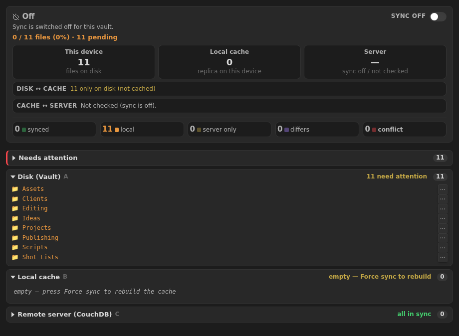
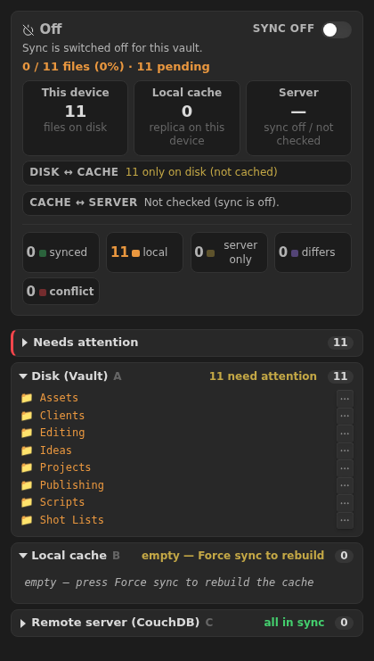

# Research: automated functional screenshots (desktop + mobile) for the README

**Goal:** capture screenshots of the *real* plugin UI — desktop and mobile layouts —
automatically and repeatably, so the README can show what each feature looks like and
stay in sync as the UI evolves.

**TL;DR recommendation:** reuse the plugin's **existing E2E harness**
(`wdio-obsidian-service`, which already drives a *real* Obsidian under Xvfb in CI) to
render the actual panel and take screenshots. It is the only option that photographs
the genuine plugin (no drift from a mock), it is deterministic (fixture vault + seeded
settings), and it already runs headless in CI. Mobile-*layout* shots are produced by
mounting the panel at a phone width — no device or emulator required. Run it as a
dedicated **manual / on-release** workflow so it doesn't add cost to every push.

This document is backed by a **working prototype** — see `e2e/screenshots/capture.e2e.ts`
and the two images it produced, committed alongside this file:

| Desktop (920px, dark) | Mobile (420px, dark) |
|---|---|
|  |  |

Both were generated by running the harness in this environment — the real `IndexPanel`,
real Obsidian 1.13.4, no hand-editing. The prototype forces Obsidian's **dark base
theme** and seeds a realistic **creative video-editing** demo vault at runtime
(Projects / Clients / Editing / Shot Lists / Assets / Publishing …) so the shots read
like a real workflow. The committed fixture (`e2e/vaults/simple`) is left untouched —
the demo files live only in the running test instance (see `before()` in
`capture.e2e.ts`).

---

## The options, compared

### 1. Reuse the E2E harness (wdio-obsidian-service) — **recommended**

The repo already has `e2e/` running WebdriverIO + `wdio-obsidian-service`, which boots a
real Obsidian (Electron) with the built plugin, on Linux under `Xvfb` + `herbstluftwm`
(see `.github/workflows/e2e.yml`). Screenshots are one call away:

- **Full window:** `await browser.saveScreenshot("out.png")`
- **A single element** (crop to just the panel): `await $(".couchdb-sync-view").saveScreenshot("out.png")`

**Desktop vs mobile layout without a device.** Obsidian's Electron chromedriver does *not*
support window resizing (`Browser.getWindowForTarget` is missing), so we don't resize the
window. Instead the prototype mounts the plugin's own panel into a throwaway
`div.couchdb-sync-view` of a fixed width and takes an *element* screenshot:

- `420px` → the mobile single-column layout (store cards + counters reflow).
- `920px` → the desktop layout.

This is the *same panel code*, just constrained to a width — so it is a faithful preview
of the responsive layout, produced deterministically.

**Pros**
- Photographs the **real plugin** in **real Obsidian** — zero drift from a mock.
- **Deterministic**: fixture vault (`e2e/vaults/simple`) + seeded `plugin.settings` +
  state you set up in code → the exact screen you want, every time.
- Already **headless-CI-ready** (Xvfb); the binaries are cached (`.obsidian-cache/`).
- Can drive the app into **any feature state** before shooting (see "Deterministic
  states" below): in-sync, conflicts, drift, server-only, the 401 error card, post-wipe.
- Can capture **light and dark** themes, and the **settings** (compact) vs **sidebar**
  (full) surfaces.

**Cons / caveats**
- Mobile shots are layout-accurate but rendered by *desktop* Obsidian — they show our
  panel exactly, but not the iOS/Android system chrome (status bar, etc.). For most
  README needs this is ideal; for true device chrome see option 4.
- Boot is slow (~5–10s per Obsidian session), so this is a "run occasionally" job, not a
  per-commit one.

### 2. `app.emulateMobile(true)` — authentic mobile *mode*

Obsidian ships an (undocumented but widely used) `app.emulateMobile(boolean)` that flips
`Platform.isMobile` and the mobile CSS/behaviour for the whole app. Combined with option
1's fixed width it yields a screenshot that is mobile in both *layout and behaviour*.
Call it via `executeObsidian(({app}) => app.emulateMobile(true))`, capture, then reset.

**Pros:** most authentic mobile rendering achievable without a device.
**Cons:** undocumented API (could change); needs a reset in a `finally` so it doesn't
leak into other runs. Worth adding to the capture script as an enhancement.

### 3. Standalone HTML render + Playwright (the "mockup" approach)

Render the panel markup into a data-URL / static HTML and screenshot with Playwright
(Chromium is preinstalled here). This is exactly how the design mockups earlier in this
project were produced.

**Pros:** fast, pixel-perfect, trivial to theme and size; great for *design* proposals.
**Cons:** it is **not the real plugin** — it screenshots a copy of the markup, which will
silently drift from the shipped code. Good for concept art, **wrong for documenting real
functionality**. Not recommended for the README's functional screenshots.

### 4. True device screenshots (iOS Simulator / Android emulator)

Run Obsidian mobile + the plugin on the iOS Simulator (needs a **macOS** runner) or an
Android emulator, and screenshot the OS.

**Pros:** the genuine mobile app, real system chrome.
**Cons:** heavy and expensive to automate — macOS runners for iOS, emulator setup for
Android, plus installing the plugin into the mobile app. Overkill for README imagery.
Keep as a rare, manual "hero shot" step if ever needed; **not** for regular automation.

### 5. Manual screenshots (status quo)

What we do today (you sending phone/desktop captures). Perfect fidelity, zero
infrastructure, but **doesn't scale** and goes stale as features change.

---

## Deterministic feature states (the real value)

The point of automation is a **feature gallery** that always matches the code. Because
the harness runs real code, we can seed each state and shoot it:

| Screenshot | How to reach it in the capture spec |
|---|---|
| **All in sync** (green A/B/C) | seed a CouchDB, run one sync pass, then shoot |
| **Local-only / pending** | fixture files on disk, empty cache (what the prototype shows) |
| **Conflict + diff** | write two divergent revisions of one file, then shoot + open the diff modal |
| **Differs (drift)** | change a file's content vs the cached hash |
| **Server-only** | put a doc on the server that isn't on disk |
| **Server ✕ 401** | `connectionVerified=true`, `syncEnabled=true`, bad creds → the honest error card |
| **After wipe** | `wipeLocalOnly()` → empty cache tree, full disk/server |
| **Per-file ⋯ menu** | open the menu on a row, then shoot |

**Full green A/B/C needs a real server.** The repo already has
`docker-compose.couchdb.yml` and the gated `sync-roundtrip` spec; a CI service container
(as in `e2e.yml`) provides a throwaway CouchDB so the "Server" column is populated. (Note:
this sandbox has no Docker, so the prototype above shows `Server —` with sync off; in CI
with the service container we can produce the full green three-store shot.)

**Themes:** capture light and dark by toggling the theme
(`executeObsidian(({app}) => app.changeTheme?.('obsidian'|'moonstone'))` or setting
`document.body` theme classes) and shooting each — giving `*-light.png` / `*-dark.png`.

---

## How to run it regularly (cadence options)

Since E2E was deliberately made **manual-only** to save Actions minutes, screenshots
should follow the same philosophy — regenerate them *when the UI changes*, not on every
push:

- **A) Dedicated manual workflow `screenshots.yml`** (`workflow_dispatch`) — reuses the
  `e2e.yml` setup (Node, cache Obsidian binaries, Xvfb + WM, optional CouchDB service),
  runs the capture spec, and **uploads the PNGs as build artifacts** for review.
  *Cheapest and safest.* **Recommended baseline.**
- **B) Also on release** (`on: release` / on tag) — regenerate the gallery for each
  published version so the README always matches the shipped build. Commit the PNGs back
  to `docs/screenshots/` with a `github-actions[bot]` commit (mind the auto-release loop
  guard — a `docs:`/`chore:` screenshot commit would itself cut a patch release, so
  either push it as part of the release commit or gate it out).
- **C) On PRs that touch the UI** (`paths: [src/indexpanel.ts, styles.css, src/view.ts]`)
  — auto-refresh screenshots and push them onto the PR branch. Most "always fresh" but
  the heaviest; enable later if desired.

**Recommendation:** start with **(A)** — a manual `screenshots.yml` that produces the
full gallery as artifacts. Add **(B)** once we're happy with the set, so every release
ships matching imagery. Hold **(C)** unless screenshot drift becomes a real problem.

---

## README integration

Store the gallery under `docs/screenshots/` and reference it from the README with short,
benefit-led captions — a compact feature table reads best:

```md
## Screenshots

| Full transparency: disk · cache · server | Conflicts & side-by-side diff |
|---|---|
|  |  |

| Works on mobile | Honest errors (no false "in sync") |
|---|---|
|  |  |
```

Guidelines: keep PNGs reasonably small (element crops, not 4K), provide light/dark where
it helps, and name files by feature (`conflict-diff`, `server-401`, `after-wipe`) so the
README links stay stable as the gallery grows.

---

## Suggested next steps (if we proceed)

1. Promote the prototype (`e2e/screenshots/capture.e2e.ts`) into a small **capture suite**
   that seeds each state above and shoots desktop + mobile, light + dark.
2. Add an npm script, e.g. `"screenshots": "wdio run ./wdio.conf.mts --spec ./e2e/screenshots/capture.e2e.ts"`.
3. Add `.github/workflows/screenshots.yml` (option A: manual, artifacts) reusing the
   `e2e.yml` environment, plus the CouchDB service for the full-green shot.
4. Add a **Screenshots** section to the README wired to `docs/screenshots/`.

_Prototype validated in this environment on Obsidian 1.13.4 — see the two images above._
